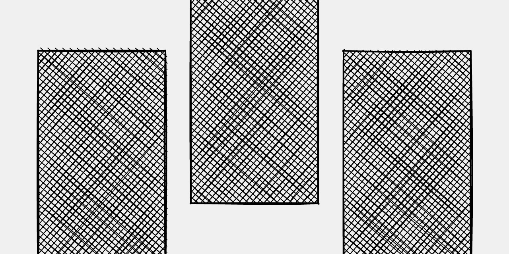

# <samp>GITHUBAW</samp>



---

This is a README template file designed to provide a unified visual experience across all projects. Use this template to maintain consistency in documentation, branding, and presentation throughout all your repositories.

---

### Phone Preview

Phasellus tristique laoreet condimentum. Praesent ligula lacus, elementum et libero at, tempus tincidunt nulla. In hac habitasse platea dictumst. Aliquam vitae ullamcorper mauris. Integer tincidunt sem vel sollicitudin ultrices.

---

### Watch Preview

Phasellus tristique laoreet condimentum. Praesent ligula lacus, elementum et libero at, tempus tincidunt nulla. In hac habitasse platea dictumst. Aliquam vitae ullamcorper mauris. Integer tincidunt sem vel sollicitudin ultrices.

---

### Tablet Preview

Phasellus tristique laoreet condimentum. Praesent ligula lacus, elementum et libero at, tempus tincidunt nulla. In hac habitasse platea dictumst. Aliquam vitae ullamcorper mauris. Integer tincidunt sem vel sollicitudin ultrices.

---

### Television Preview

Phasellus tristique laoreet condimentum. Praesent ligula lacus, elementum et libero at, tempus tincidunt nulla. In hac habitasse platea dictumst. Aliquam vitae ullamcorper mauris. Integer tincidunt sem vel sollicitudin ultrices.

---

### Getting Started

Phasellus tristique laoreet condimentum. Praesent ligula lacus, elementum et libero at, tempus tincidunt nulla. In hac habitasse platea dictumst. Aliquam vitae ullamcorper mauris. Integer tincidunt sem vel sollicitudin ultrices.

```shell
...
```

---

### Create Something

Phasellus tristique laoreet condimentum. Praesent ligula lacus, elementum et libero at, tempus tincidunt nulla. In hac habitasse platea dictumst. Aliquam vitae ullamcorper mauris. Integer tincidunt sem vel sollicitudin ultrices.

```shell
...
```

---

### Read Something

Phasellus tristique laoreet condimentum. Praesent ligula lacus, elementum et libero at, tempus tincidunt nulla. In hac habitasse platea dictumst. Aliquam vitae ullamcorper mauris. Integer tincidunt sem vel sollicitudin ultrices.

```shell
...
```

---

### Update Something

Phasellus tristique laoreet condimentum. Praesent ligula lacus, elementum et libero at, tempus tincidunt nulla. In hac habitasse platea dictumst. Aliquam vitae ullamcorper mauris. Integer tincidunt sem vel sollicitudin ultrices.

```shell
...
```

---

### Delete Something

Phasellus tristique laoreet condimentum. Praesent ligula lacus, elementum et libero at, tempus tincidunt nulla. In hac habitasse platea dictumst. Aliquam vitae ullamcorper mauris. Integer tincidunt sem vel sollicitudin ultrices.

```shell
...
```
